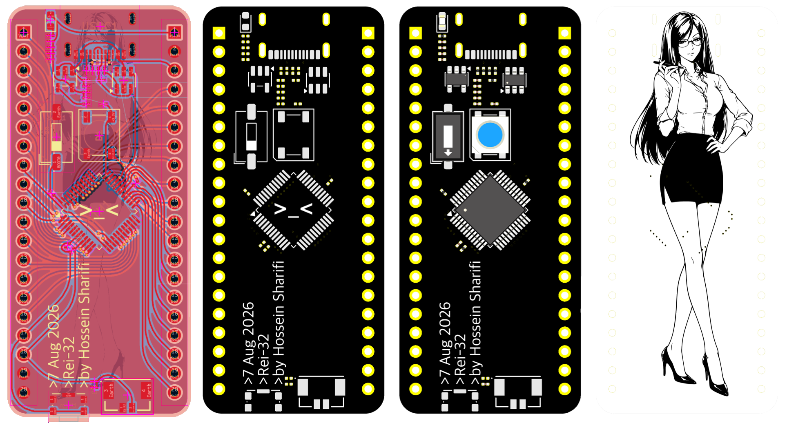

  

# Rei-32(レイ-32)
### Minimal STM32 Development Board

## Overview

 - A compact STM32 development board designed from scratch with a focus on simplicity, usability, and a clean form factor.
 -  If there’s no need for a feature, it simply isn’t included.
 -  The complete hardware design was created in **KiCad 10**, including the schematic and PCB layout.
 -  **Small board. Simple design. Full control.**

## Features

- STM32 microcontroller
- USB connectivity
- On-board WS2812B addressable LED
- Exposed GPIO pins
- Compact PCB layout
- Open hardware design

## Hardware
- Rei-32 is built around an **STM32F103C8T6** microcontroller, providing an ARM-based platform in a compact and practical form factor.

## Form Factor
- Rei-32 has dimensions of 25mm by 55mm (0.98 inches by 2.17 inches for Americans).

    PCB  +  Front  +  Front with components  +  Back

  

- The compact layout allows it to be used in projects where a larger development board would be inconvenient.

## Boot Configuration
- Rei-32 includes dedicated configuration for the STM32 boot modes.
- The boot configuration is accessible directly on the board, allowing the MCU to be placed into the required boot mode without adding external circuitry.

## Status LED
- An addressable WS2812B LED is included on the board.
- It can be used as a simple status indicator or controlled directly by firmware for debugging, state indication, and user feedback.

## Schematic
- The complete schematic is included in the repository.

## Author
- **Hossein Sharifi**
- Designed, developed, and documented as a personal hardware project.

## License

#### GNU General Public License v3.0

